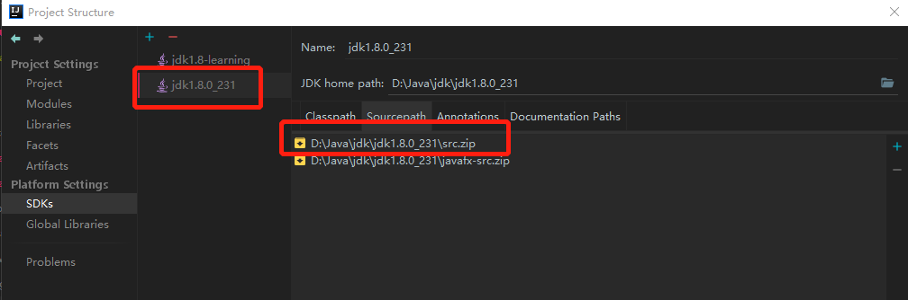
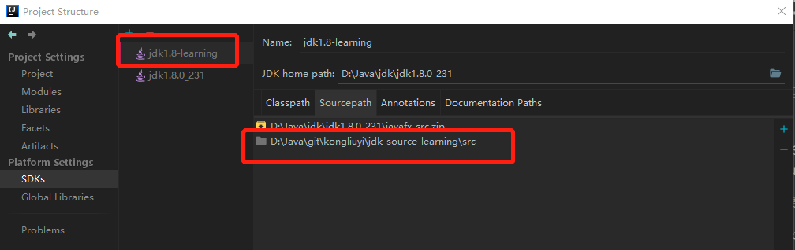
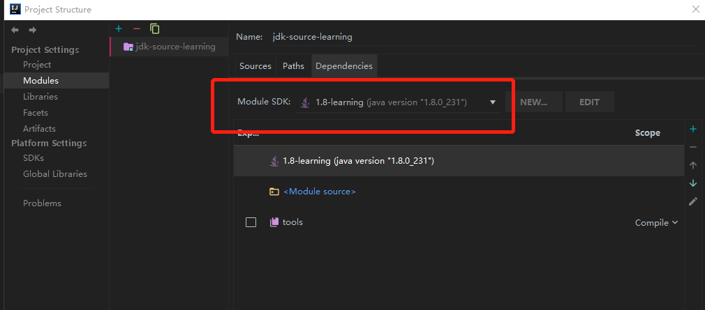
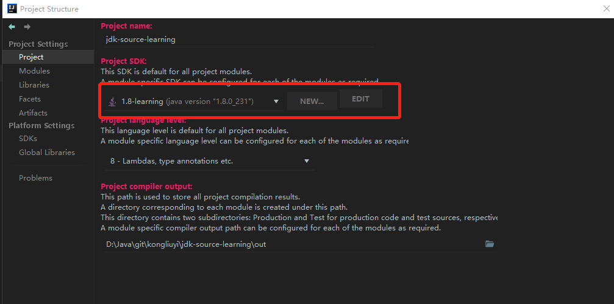
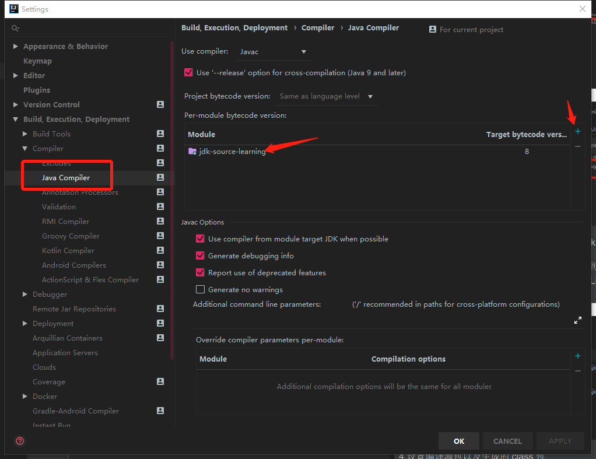
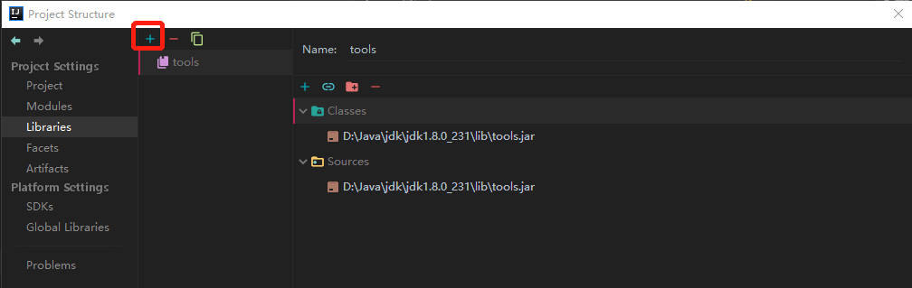
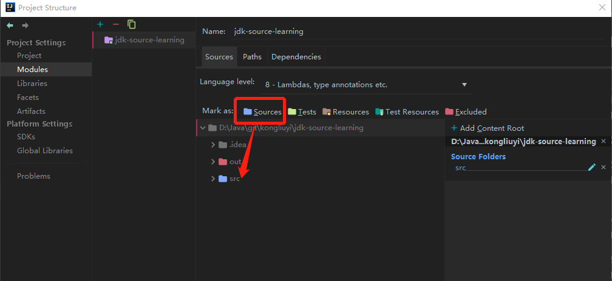
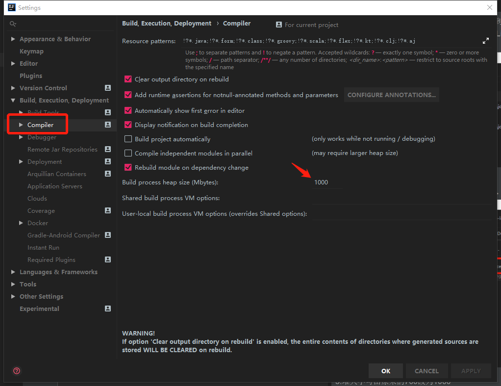

# jdk-source-learning
jdk 源码

### IDEA 搭建源码阅读环境

1.打开该源码项目  
  为了避免修改原来的 SDKs，另外再添加一个名为 “jdk1.8-learn” 的 jdk,
并移除替换本项目中的 src.zip.  
File -> Project Structure -> Platform Settings -> SDKs
 
 
 
2.将 IDEA 中所有需要设置 JDK 的全部换成 “jdk1.8-learn”  
 
 
 

3.手动将 jdk 安装目录下 lib 包中 tools.jar 添加到项目中  
File -> Project Structure -> Project Settings -> Libraries  
目的：程序包com.sun.tools.javac.api不存在
 

4.设置编译源包以及生成的 class 包  
File -> Project Structure -> Platform Settings -> Modules  
 

5.堆大小可由原来的700改为1000  
File –> Setting …–> Build,Execution,Deployment –> Compiler  
目的：Error:java: OutOfMemoryError: insufficient memory(系统资源不足)
 